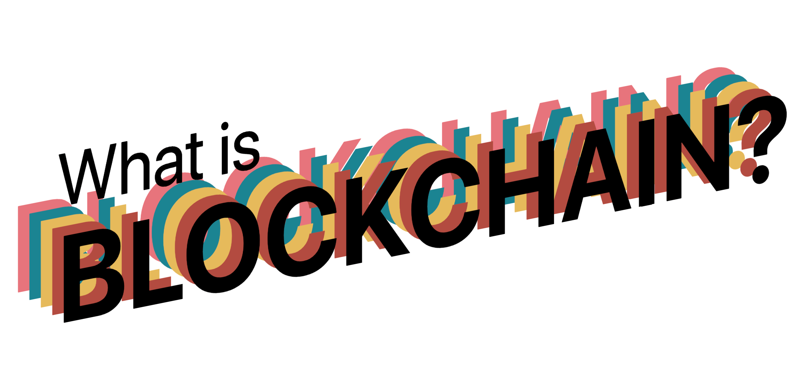

A microsite explaining the basic concepts of Blockchain in a friendly way, and
allowing you to explore the most recent Ethereum blocks if you have a
web3-enabled browser.

## Build process

The production version of this site lives in `docs/index.html`. This file is
**generated automatically** when you run `npm run build`, and should not be
edited. Only edit the files in `src`.

To get started working on this repo:

* Clone or download the code
* Run `npm install` in the project directory
* Run `npm run dev` to start the development server
* Run `npm run build` to build a new version of `index.html`

Then you can set up your GitHub repo as a GitHub Pages repo, using files from
`master` branch.

If you want to auto-build on every commit so you never forget, create a file at
`.git/hooks/pre-commit` with these contents:

    npm run build && git add docs/index.html
